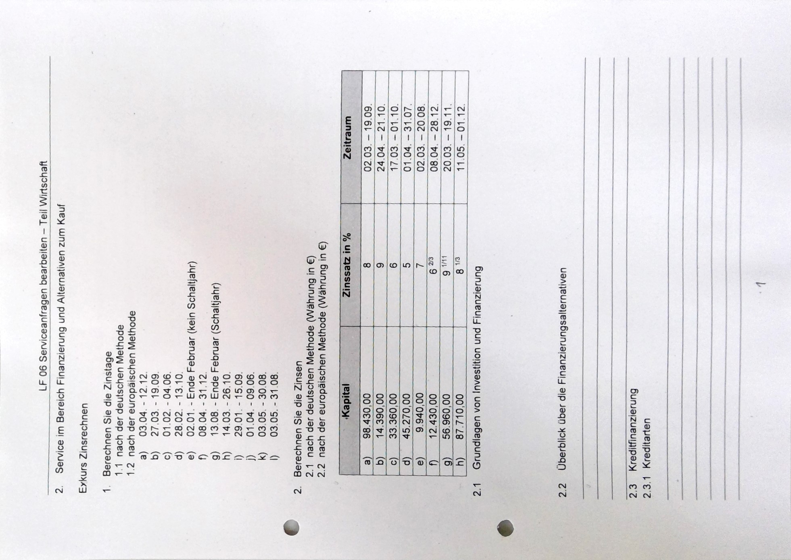

# Zinsrechnung

deutsche Methode | europäische Methode
-|-
360 Tage | 360 Tage
der erste Tag des Zinszeitraums wird nicht mitgezählt | der erste Tag des Zinszeitraums wird nicht mitgezählt
1 Monat = 30 Tage   Ausnahme: Zinszeitraum endet im Februar (28/29) | taggenauer Berechnung
||
Bsp: |28.3. bis 5.7.|
||
28.3. - 31.3. = 2 Tage|28.3. - 31.3. = 3 Tage|
1.4. - 30.6. = 90 Tage | 1.4. - 30.4. = 30 Tage
|| 1.5. - 31.5. = 31 Tage
|| 1.6. - 30.6. = 30 Tage
1.7. - 5.7. = 5 Tage | 1.7. - 5.7. = 5 Tage
= 97 Tage|= 99 Tage

||deutsche Methode|europäische Methode
-|-|-
a|249 |253
b|172|176
c|123|123
d|225|227
e|56|57
f|262|267
g|196|200
h|210|214
i|256|259
j|68|69
k|117|119
l|117|120
