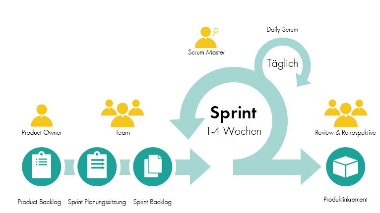

## 8. SCRUM

- eng: Gedränge
- zur agilen Softwareentwicklung, aber auch anderen Bereichen

### Beispiel

Abkürzung | Lösungsbeispiel
-|-
Planung | Das Team besteht aus einem Produktbesitzer, drei Entwicklern und einem Scrum-Master. Das Team erstellt eine Liste von Anforderungen für die zu entwickelnde Software und erstellt ein Product Backlog
Sprint | Das Team wählt einen Zeitraum von zwei Wochen für den ersten Sprint aus. Es wählt die wichtigsten Anforderungen aus dem Product Backlog aus und beginnt mit der Entwicklung. 
Daily Scrum | Jeden Tag treffen sich das Team und bespricht den Fortschritt des aktuellen Sprints. Die Entwickler teilen ihre Arbeitsfortschritte und Probleme mit, und das Team diskutiert Lösungen.
Sprint Review | Am Ende des Sprints stellt das Team die entwickelten Funktionalitäten dem Produktbesitzer vor. Der Produktbesitzer gibt Feedback und bespricht eventuelle Änderungen im Product Backlog. 
Sprint Retrospective | Das Team diskutiert, was während des Sprints gut lief und was verbessert werden kann. Es identifiziert Maßnahmen, die in zukünftigen Sprints umgesetzt werden können, um die Prozesse und Praktiken zu verbessern.
Wiederholung | Das Team wiederholt den Prozess mit einem neuen Sprint und führt kontinuierliche Verbesserungen durch.

Scrum AB1

Scrum AB2

Scrum AB3

Scrum Schema

[zum Anfang](#1-projektmanagement)